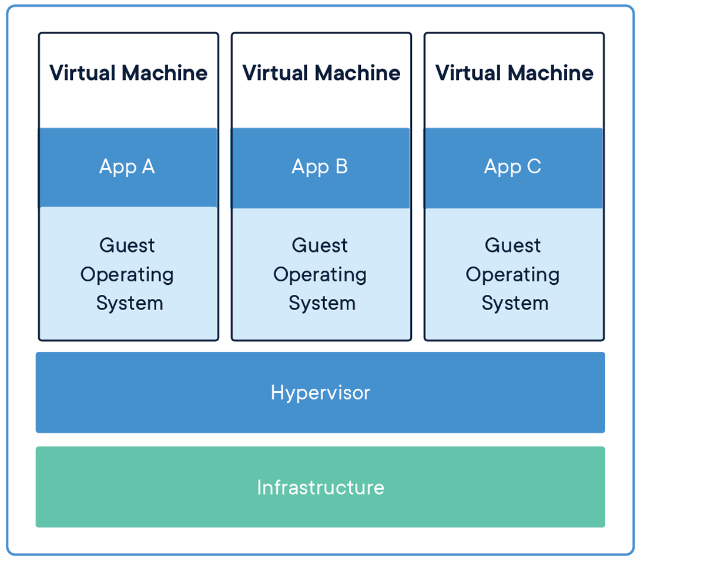

# Inception
## What's Docker?
* A tool that allows developers to deploy applications in a sandbox (containers) to run on the host operating system
* Works kind of like a virtual machine but has less overhead. It occupies less memory space, has quicker bootup, is easy to scale, and volume storage can be shared across host and the containers
* allows users to package an app with all dependencies into a standardized unit for software development
* container-based applications can be deployed easily and consistently, and can be run anywhere

### Architectural difference between Docker and VM
**DOCKER**  
* Infrastructure - physical machine that app is running on like CPU, hard disk, etc
* Host Operating System - computer OS
* Docker - builds and runs the app for you
* App - individual containers all running on one network (or if you have more than one type of app, multiple networks)
  
**VM**
* Infrastructure - physical machine that app is running on like CPU, hard disk, etc
* Hypervisor - software that creates and manages VMs
* Each VM has it's own app and guest operating system

### How Docker works
1. Write a Dockerfile to build a Docker image
2. `docker build` -> Docker daemon reads instructions in Dockerfile and builds the image
3. `docker run` -> Docker daemon creates a container from image and runs app inside container
4. Docker can view, stop, and manage containers. We can also push Docker image to a registry to share with others

## Basic Commands
Command | Description
:----------- | :-------------
docker build | build Docker image from a Dockerfile
docker pull | fetches image from a registry
docker images | see list of all images on your system
docker run | run a docker container based on Docker image
docker run --rm | automatically deletes container once it's exited
docker ps | show all containers currently running
docker rm | delete containers after use; you will seee the ID echoed back
docker container prune | same as command above for later versions of docker
docker rmi | delete images
docker stop | stop running container
docker exec | execute a command in a running container
docker logs | view logs for a container
docker push | push Docker image to a registery

## Terminology
Terminology | Definition
:----------- | :-------------
Images | blueprints for our applications
Containers | created from images and used to run application
Docker Daemon | background service running on the host that manages building, running, and distributing Docker containers
Docker Client | command line tool allowing user to interact with the daemon
Docker Hub | registry of Docker images
Detached mode | container continues to run in the background even if the terminal is closed
Exposed ports | allows making network services running inside a container accessible outside or to other containers

## Docker Images
* basis of containers
* use `docker images` command to see list of all available images
* image is kind of like a git repository - they can be committed with changes and there could be multiple versions. If no version number is specified, the default is latest
* to pull a specific version of ubuntu image: `docker pull ubuntu:18.04'
* we can pull docker images form registry or create our own
  * use `docker search` in command line to look for specific images
* There are different types of images
  * **base:** has no parent, usually has an OS like ubuntu, busybox, or debian
  * **child:** built on base images iwth additional functionality
  * **official:** can be both base and child; images that officially maintained and supported by docker
  * **user:** can be both base and child; images created and shared by users. typically formatted as `user/image-name`

## Dockerfile
* text file that contains a list of commands that Docker calls to create an image
* specifies base image to use, dependencies, software to install, and any other configs or scripts needed to set up the environment for the app to run
* similar to linux commands

### Dockerfile commands
Terminology | Definition
:----------- | :-------------
ADD | Add local or remote files and directories to Docker image. Similar to copy, but it can copy files from a remote URL (which COPY cannot), automatically extract compressed files into destination directory, and allows specifying a URL where Docker will download the source and copy it into the image
ARG	| Use build-time variables. Example: `ARG VERSION = latest \ FROM nginx:$VERSION`
CMD	| Specify default commands to run when a container is started from an image. Syntax can be specified in shell form (CMD command param1 param2) or exec form (CMD ["executable", "param1", "param2"]). There can only be 1 CMD instruction in a Dockerfile
COPY | Copy files and directories into the image. COPY `<source path in host> <destination path in image>`
ENTRYPOINT | Specify default executable to be run when a container is started from image. Syntax: `ENTRYPOINT ["executable", "param1", "param2"]`. See below for more on difference between CMD and ENTRYPOINT
ENV | Set environment variables. Syntax: `ENV key1=value1 \ key2=value2`
EXPOSE | Describe which port(s) your application is listening on. It does not publish the ports
FROM | Specify base image from which you're building your new image. Must be the first instruction in a Dockerfile. Syntax: `FROM image_name[:tag] [AS name]`. Usually the tag denotes the version of the base image like `ubuntu:20.04` or `nginx:latest`. Only one FROM instruction can be used in a Dockerfile except in the case of a multi-stage build
HEALTHCHECK | Check a container's "health" on startup (is it running properly). Example: `HEALTHCHECK --interval=5s --timeout=3s \ CMD curl -f http://localhost/ || exit 1`
LABEL | Add metadata to Docker image. Used for organizational purposes and can be viewed using `docker inspect`. Example: `LABEL maintainer="example@example.com" \ LABEL description="This is a sample Dockerfile"`
MAINTAINER | Specify the author of an image. Generally, using LABEL to specify the maintainer is better. 
ONBUILD | Specify instructions for when the image is used as a build (base for another image)
RUN	| Execute commands during build process of Docker image. Each instruction creates a new layer in the image. Example: `RUN apt-get update && apt-get install -y curl` Since each command creates a layer, we can chain commands together using && to to minimize number of layers created
SHELL | Set the default shell of an image. By default, Docker uses `/bin/sh -c` as the shell. Syntax: `SHELL ["executable", "parameters"]` Example: `SHELL ["/bin/bash", "-c"]`
STOPSIGNAL | Specify the system call signal for exiting a container such as `STOPSIGNAL SIGINT`
USER | Set user and group ID that container should run as. Syntax: `USER <user>[:<group>]`. user is the username or UID of the user to switch to. gropu is the group name or GID (group identifier), if not specified, the primary group of the user is added. This instruction can be used for running containers with reduced privileges and improves security by limiting actions that container can perform
VOLUME | Create mount point in the docker container. Docker will create a new volume or use an existing volume at the specified path. Any data written to that path in the container will be stored outside container's writable layer which means it persists even after container is removed. It is commonly used to store information like config files, database files, log files, or any other "permanent" data. Volumes also make it easy to share data beteen multiple containers or between a container and host machine. Syntax: `VOLUME /path/to/mount/point` 
WORKDIR | Change working directory for RUN, CMD, ENTRYPOINT, COPY, and ADD instructions. 

### ENTRYPOINT VS CMD
* An ENTRYPOINT and CMD are two parts of the same where ENTRYPOINT is used first and CMD is used second by default.
* ENTRYPOINT must be overriden manually, otherwise it will always be run when we start our container. To override: `docker run --entrypoint="/path/to/entrypoint.sh" my-container`
* CMD will be overriden if we pass any other commands on the command line when starting the container

Let's take a look at the following sample:  
```
FROM debian:buster
COPY . /myproject
RUN apt-get update ...
ENTRYPOINT ["entrypoint1.sh"]
CMD ["cmd1", "cmd2"]
```
* `docker run my-container` Execution: entrypoint1.sh cmd1 cmd2
* `docker run my-container cmd3` Execution: entrypoint1.sh cmd3

**When should I use CMD and ENTRYPOINT**
* ENTRYPOINT is a great tool but it is not always transparent as it hides the command logic
* use ENTRYPOINT when your container MUST execute something at every start
* otherwise use CMD as it is more flexible  

**Source**: https://www.youtube.com/watch?v=U1P7bqVM7xM

### What are layers in a Dockerfile?
Each new instruction in a Dockerfile creates a **layer**. Layers are used to optimize caching and improve build speed. Docker uses a caching mechanism that checks if the command and its arguments match any previous commands in the Dockerfile. If yes, Docker reuses the cached layer instead of rebuilding. However, additional layers also mean more overhead and increased size for the image. When layering, consider the following:  
1. Combine related commands if you can
2. Use multi-stage builds to separate build-time dependencies from the final image. Multi-stage builds allow you to use different base images for your build vs runtime environments. Its basically like writing two Dockerfiles inside one
3. Optimize the order of your commands to take advantage of the caching mechanism

### Sample Dockerfile
```
# specify base image  
FROM python:3.8

# set a directory for the app
WORKDIR /usr/src/app

# copy all the files to the container
COPY . .

# install dependencies
RUN pip install --no-cache-dir -r requirements.txt

# define the port number the container should expose
EXPOSE 5000

# run the command
CMD ["python", "./app.py"]
```

## Docker Compose
### What is Docker Compose
* Docker Compose is a YAML(yet another markup language) file that runs multi-container Docker applications. You can use it to define the services, networks, and volumes needed for the application in a single file.
* filename: `compose.yaml`. can also be `docker-compose.yaml` or `docker-compose.yml`
* use `docker compose` command to interact with the file
* we can have multiple compose files to represent different configurations for different parts of the project

### Common keys in a Docker Compose file
To see the full documentation of all keys:  
https://docs.docker.com/compose/compose-file/compose-file-v3/

**SERVCES**
A service definition contains configuration that is applied to each container started for that service, similar to passingƒ command line parameters to docker run. Anything specified in Docker file does not need to be specified again in YAML file  

* `services`: define containers that your app requires 
	* `image`: defines Docker image that continer will run
	* `build`: tells compose how to build the image if it doesn't exist yet; can be speicifed as a path or object with path specified under `context`
	* `context`: path to a directory containing a Dockerfile or a url to a git repository'
	* `args`: define build-time variables that can be used in the Dockerfile during image build process. These variables will be passed to the Docker build process when using the docker-compose build command. Pass as maping or a list. Omit arg values when specifying a build argument - default value is value in the environment where compose is running.
	* `network`: specify networks that the service should be set to
	* `target`: build specified stage as defined inside Dockerfile in the case of a multi-stage build
	*  `container_name`: specify a custom container name rather than a generated default name
	* `depends_on`: specify dependency between services. define order in which services should be started or stopped when using `docker-compose up` or `docker-compose down` commands.
	* `ports`: maps container ports to host machine ports
	* `volumes`: mounts host paths or named volumes into the container
	* `environment`: set environment variables in a container
	* `env_file`: add environment variables from a file
	* `expose`: expose ports without publishing them to the host machine. An exposed port refers to a port on a container that is made accessible to the outside world or to other containers. They will only be accessible to linked servies. Only the internal port can be specified. To publish a port use the -p option in `docker run`
	* `command`: override default command specified by Docker image
	* `restart`: controls the restart policy for the service
	* `healthcheck`: configures a health chekc for the service
	* `configs`: specify configurations for the service
	* `aliases`: specify alternative hostnames for this service on the network. network-scoped, which means the same service can have a different alias on a different network. 
	* `ipv4_address, ipv6_address`: specify a static IP address for containers for this service when joining the network
	* `secrets`: used to specify one or more secrets that should be made available to the services  in the stack. Examples: passowrds, API keys. Docker will store the file in an encrypted format and only make them available to the services at runtime. Use `docker secrete create` command

**VOLUMES**
create named volumes or bind mounts that can be reused cross mutiple services without relying on `volumes_from`. Volumes are used to persist data generated by and used by Docker containers.  
1. Named volumes: managed by Docker and created and managed outside of container lifecycle. Typically preferred for production use since they are easier to manage and provide better isolation.
2. Bind mounts: links a directory or file on the host machine to a directory in the container. Used for development because they allow you to make changes to your code and have them reflected in container immediately. 
	* Mounting refers to attaching a filesystem (or specific file or directory)from the host machine to a specific location within a container

* `volumes`:
	* `driver`: specify which volume driver should be used for this volume
	* `driver_opts`: specify a list of options as  key-value pairs to pass to the dirver for this volume
	* `external`: if set to `true`, specifies that this volume ha been created outside of compose
	* `name`: set a custom name for volume

**NETWORKS**
specify networks to be created
* `networks`:
	* `driver`: specifies network driver to use for network
		* `bridge` and `overlay` are two built-in drivers that we can use
	* `driver_opts`: specifies options to pass to the other network driver
	* `external`: specifies that the network is external to the Compose file
	* `name`: specifies the name of the network


### Example
The example application is composed of the following parts:  
* 2 services, backed by Docker images: webapp and database
* 1 secret (HTTPS certificate), injected into the frontend
* 1 configuration (HTTP), injected into the frontend
* 1 persistent volume, attached to the backend
* 2 networks

```
services:
  frontend:
    image: example/webapp
    ports:
      - "443:8043"
    networks:
      - front-tier
      - back-tier
    configs:
      - httpd-config
    secrets:
      - server-certificate

  backend:
    image: example/database
    volumes:
      - db-data:/etc/data
    networks:
      - back-tier

volumes:
  db-data:
    driver: flocker
    driver_opts:
      size: "10GiB"

configs:
  httpd-config:
    external: true

secrets:
  server-certificate:
    external: true

networks:
  # The presence of these objects is sufficient to define them
  front-tier: {}
  back-tier: {}
```

## Multi-Container Environments
* There is usually a database or storage associated with apps (see Redis and Memcached)
* keep separate containers for separate services
* cURL request - a command-line tool for transferring data with URLs. For example, curl https:://example.com will send and HTTP GET request to the provided url and print response to the terminal
* Must connect containers to each other

### Docker Network
* `docker container ls` (same as `docker ps`) -> see container id and information
* docker creates three automatic networks
	* bridge -> this is the default network in which containers are run
	* host
	* none
	* we can inspect the network with `docker network inspect <network name>`
	* use IP address given here to allow two containers to talk to each other
* We need to isolate our network (since bridge is shared by every container)
	* use `docker network` command to create our own network
	* `docker network create <name>`
	* creates a new bridge network
		* uses a software bridge - containers connected to same bridge network can communicate
		* isolated from containers not connected to bridge network
		* Docker bridge driver automatically installs rules in host machine so that containers on different bridge networks cannot communicate directly with each other
* launch containers inside network using `--net` flag
	* don't forget to stop and remove other container so that it can be launched in new network
	* containers can also resolve a container name to an IP address - called automatic service discovery

## NGINX
### What is NGINX
Nginx is a popular open-source web server and reverse proxy server. Nginx can handle a higher number of conccurent requests (compared to its competitor, Apache HTTP Server) and it has faster static content delivery with low resource usage

### What is a reverse proxy server
A reverse proxy server is a server that sits between client devices (like web browsers) and backend servers. It receives requests from clients and forwards them to the appropriate backend server. Response from backend server is then returned to the client while hiding the backend server's identity and characteristics of the client. Reverse proxies are generally owned by web services (vs a forward proxy that is owned by the client).  

**Why use a reverse proxy?**
1. protect website - reverse proxies can provide an additional layer of security by hiding the backend server's IP address and implementing security features such as access control and SSL/TLS termination.
2. load balancing - reverse proxies distribute incoming client requests across multiple backend servers to improve performance and reliability.
3. caching static content - if static content is constantly being requested, the reverse proxy can send cached information locally rather than asking backend servers
4. handles ssl encryption - this way, servers only have to handle ssl handshake from a small number of reverse proxies rather than from all clients

**Terms**  
* URI - Uniform Resource Identifier. A string of characters that provides a unique address used to identify a resource such as a web page, file, or service. URIs can be further classified into URL and URN
* URL - Uniform Resource Locator. Specifies the network location (domain name/IP address of server and path to resource on server) of a resource and the protocol (http, https, ftp) used to access it. 
* URN - Uniform Resource Name. provides a unique name for a resource but does not specify how to locate it. They are persistnet and location-independent . For example, `urn:isbn:0451450523`, which identifies a book by its ISBN number is a URN

### NGINX config files
* ends with `.conf` extension
* found inside the `/etc/nginx/` directory
* every time config file is updated, we will need to restart or reload nginx as the file is generally only read once

Command | Description
:----------- | :-------------
`sudo nginx -t` | to validate config files:
`sudo systemctl restart nginx` | restart nginx service
`nginx -s reload` | send reload command to nginx
`curl -i <site>` | send get request to the server 

Example:
```
events {
}
http {
    server {
        listen 80;
        server_name nginx-handbook.test;

        return 200 "Bonjour, mon ami!\n";
    }
}
```

**Directives**  
* Simple - end in semicolon
* Block - consist of curly braces with more instructions inside
* See list of all directives: https://nginx.org/en/docs/dirindex.html

**Contexts**  
* `events { }`: set global configuration for how nginx will handle requests on a general level. There can only be one `events` in config file
* `http { }`: define how server will handle HTTP and HTTPS requests. Can only have one `http` context in a config file
* `server { }`: nested inside `http` context. Used for configuring specific virtual servers within a single host. There can be multiple `server` contexts
* `main`: configuration of the file itself. Anything outside of the other three contexts will fall inside the `main` context

**Server**  
How does nginx know which server will handle a request if there are multiple servers?  
1. Use the `listen` directive. It specifies the IP address and port number on which the server should listen for incoming connections   
Example:  
```
http {
    server {
        listen 80;
        server_name nginx-handbook.test;

        return 200 "hello from port 80!\n";
    }


    server {
        listen 8080;
        server_name nginx-handbook.test;

        return 200 "hello from port 8080!\n";
    }
}
```

2. Use `server_name` directive. Used to specify the domain name or IP address that should match the server block in the nginx config. Typically used to define the virtual server that should process a request based on the requested domain name.  
Example:  
```
http {
    server {
        listen 80;
        server_name library.test;

        return 200 "your local library!\n";
    }


    server {
        listen 80;
        server_name librarian.library.test;

        return 200 "welcome dear librarian!\n";
    }
}
```
* If we send a request to http://library.test, we'll get "your local library!".   
* If we send a request to http://librarian.library.test, we'll get "welcome dear librarian!".  
* The `return` directive tells nginx what to return to user. It takes the status code and string message to be returned. 

**Testing demo**
update `hosts` file to include domain names:
```
192.168.20.20   library.test
192.168.20.20   librarian.library.test
```

### Serving static content
* need to store files on the server - `/serv` directory  

Example: 
```
events {
}
http {
    server {
        listen 80;
        server_name nginx-handbook.test;

        root /srv/nginx-handbook-projects/static-demo;
    }
}
```
Instead of `return`, we use `root` directive, which declares root directory for a site. This directive tells nginx to look for files to serve inside of specified directory.  

**Static file type handling**  
Example:  
```
events {
}
http {
    types {
        text/html html;
        text/css css;
    }
    server {
        listen 80;
        server_name nginx-handbook.test;

        root /srv/nginx-handbook-projects/static-demo;
    }
}
```
* Use `types` context to tell nginx how to parse files.  
* nginx will parse any files that end with html extension as a text/html.  
* any files ending wtih css extension will be served as text/css.  
* we must configure all file types here, because nginx does not know how to automatically read file extensions

**How to include partial config files**  
* With bigger projects, using `types` can be prone to errors
* use `mime.types` in `/etc/nginx`  
Example:
```
events {
}
http {
    include /etc/nginx/mime.types;
    server {
        listen 80;
        server_name nginx-handbook.test;

        root /srv/nginx-handbook-projects/static-demo;
    }
}
```
* use `include` directive to include content from other config files

### Dynamic Routing 
What happens when a client requests a route that doesn't exist?  

**Location matches**  
* `location` context: used to define how nginx should handle requests for specific URLs or patterns of URLs. 
Example:  
```
events {

}

http {

    server {

        listen 80;
        server_name nginx-handbook.test;

        location /agatha {
            return 200 "Miss Marple.\nHercule Poirot.\n";
        }
    }
}
```
* in the above example, sending a request to http://nginx-handbook.test/agatha and to http://nginx-handbook.test/agatha-christie will give you the same response (a 200 response code and the string "Miss Marple.\nHercule POirot.\n")
* Prefix match: `location /agatha` tells nginx to match any URI starting with "agatha.
* Exact match: `location = /agatha` tells nginx to respond only if URL matches exactly. Anything else will yield a 404 response
* Regex match: `location ~ /agatha[0-9]` tells nginx to check location URLs against complex regular expressions. `~` means to perform a regular expression match. nginx will only respond if there is a number after th word agatha. This expression is case sensitive
	* to make this match case INSENSITIVE, `location ~* /agatha[0-9]`.
* Preferential prefix match: nginx assigns priority so that regex match > prefix match. However, to prefer prefix, use the `^~` modifier:  
```
events {

}

http {

    server {

        listen 80;
        server_name nginx-handbook.test;

		location ^~ /Agatha8 {
        	return 200 "prefix matched.\n";
        }
        
        location ~* /agatha[0-9] {
        	return 200 "regex matched.\n";
        }
    }

}
```

MATCH | MODIFIER
:----------- | :-------------
Exact | =
Preferential Prefix | ^~
REGEX | ~ or ~*
Prefix | None

### Variables
* Use `set` directive to declare new variables anywhere in config file.  
* Three types of variables:
	* string
	* integer
	* boolean
* nginx also has embedded variables which can be found here: https://nginx.org/en/docs/varindex.html

Example:
```
set $<variable_name> <variable_value>;

# set name "Farhan" -> set $name "Farhan";
# set age 25 -> set $age 25
# set is_working true set $is_working true;


events {

}

http {

    server {

        listen 80;
        server_name nginx-handbook.test;

        return 200 "Host - $host\nURI - $uri\nArgs - $args\n";
    }

}
```

if we run the the following request, we'll get this response:  
```
# curl http://nginx-handbook.test/user?name=Farhan

# Host - nginx-handbook.test
# URI - /user
# Args - name=Farhan
```

We can also access individual values using $arg variable
```
events {

}

http {

    server {

        listen 80;
        server_name nginx-handbook.test;
        
        set $name $arg_name; # $arg_<query string name>

        return 200 "Name - $name\n";
    }

}
```

and we will get the following
```
curl http://nginx-handbook.test?name=Farhan

# Name - Farhan
```

### Redirects and rewrites
* A redirect will redirect a request to another page.   
```
events {

}

http {

    include /etc/nginx/mime.types;

    server {

        listen 80;
        server_name nginx-handbook.test;

        root /srv/nginx-handbook-projects/static-demo;

        location = /index_page {
                return 307 /index.html;
        }

        location = /about_page {
                return 307 /about.html;
        }
    }
}
```
a request to http://nginx-handbook.test/about_page will be redirected to http://nginx-handbook.test/about.html  

* a rewrite directive changes URI internally without letting the user know. 
```

events {

}

http {

    include /etc/nginx/mime.types;

    server {

        listen 80;
        server_name nginx-handbook.test;

        root /srv/nginx-handbook-projects/static-demo;

        rewrite /index_page /index.html;

        rewrite /about_page /about.html;
    }
}
```
* A code of 200 is given as well as the full html code for the about.html file.  
* The URL will remain unchanged (unlike redirect, which will take us to http://nginx-handbook.test/about.html)

```
curl -i http://nginx-handbook.test/about_page

# HTTP/1.1 200 OK
# Server: nginx/1.18.0 (Ubuntu)
# Date: Thu, 22 Apr 2021 18:09:31 GMT
# Content-Type: text/html
# Content-Length: 960
# Last-Modified: Wed, 21 Apr 2021 11:27:06 GMT
# Connection: keep-alive
# ETag: "60800c0a-3c0"
# Accept-Ranges: bytes

# <!DOCTYPE html>
# <html lang="en">
# <head>
#     <meta charset="UTF-8">
#     <meta http-equiv="X-UA-Compatible" content="IE=edge">
#     <meta name="viewport" content="width=device-width, initial-scale=1.0">
#     <title>NGINX Handbook Static Demo</title>
#     <link rel="stylesheet" href="mini.min.css">
#     <style>
#         .container {
#             max-width: 1024px;
#             margin-left: auto;
#             margin-right: auto;
#         }
# 
#         h1 {
#             text-align: center;
#         }
#     </style>
# </head>
# <body class="container">
#     <header>
#         <a class="button" href="index.html">Index</a>
#         <a class="button" href="about.html">About</a>
#         <a class="button" href="nothing">Nothing</a>
#     </header>
#     <div class="card fluid">
#         
#     </div>
#     <div class="card fluid">
#         <h1>this is the <strong>about.html</strong> file</h1>
#     </div>
# </body>
# </html>
```

* `rewrite` causes the `server` context go be re-evaluated by nginx. therefore, it is more expensive than a redirect

### Try for multiple files
the `try_files` directive lets you check for the existence of multiple files.  
Example:  
```

events {

}

http {

    include /etc/nginx/mime.types;

    server {

        listen 80;
        server_name nginx-handbook.test;

        root /srv/nginx-handbook-projects/static-demo;

        try_files /the-nginx-handbook.jpg /not_found;

        location /not_found {
                return 404 "sadly, you've hit a brick wall buddy!\n";
        }
    }
}
```
* `try_files /the-nginx-handbook.jpg /not_found;` instructs nginx to look for a file named the-nginx-handbook.jpg on the root whenever a request is received. If it doesn't exist, we go to the /not_found location
* to make this better (since with this config, we will always get the tryfile jpg since it does exist in the folder), we use the $uri variable
* ` try_files $uri /not_found;` tells nginx to try for the URI requested by the client first
* `try_files $uri $uri/ /not_found;` nginx will look for the URI first, and if that doesnt work, it will look for the uri as a directory

## Logging
* log files located in `/var/log/nginx`
* `sudo nginx -s reopen` if you delete any logs and create new ones, need to refresh. otherwise, nginx will keep writing to previously opened stream
* access and error logs
* use `access_log` directive to customize logging behavior  
Example:
```
events {

}

http {

    include /etc/nginx/mime.types;

    server {

        listen 80;
        server_name nginx-handbook.test;
        
        location / {
            return 200 "this will be logged to the default file.\n";
        }
        
        location = /admin {
            access_log /var/logs/nginx/admin.log;
            
            return 200 "this will be logged in a separate file.\n";
        }
		#write any access log of this URI to /var/logs/nginx/admin.log
        
        location = /no_logging {
            access_log off;
            
            return 200 "this will not be logged.\n";
        }
		#turns off access logs for this location completely
    }
}
```
This yields:
```
curl http://nginx-handbook.test/no_logging
# this will not be logged

sudo cat /var/log/nginx/access.log
# empty

curl http://nginx-handbook.test/admin
# this will be logged in a separate file.

sudo cat /var/log/nginx/access.log
# empty

sudo cat /var/log/nginx/admin.log 
# 192.168.20.20 - - [25/Apr/2021:11:13:53 +0000] "GET /admin HTTP/1.1" 200 40 "-" "curl/7.68.0"

curl  http://nginx-handbook.test/
# this will be logged to the default file.

sudo cat /var/log/nginx/access.log 
# 192.168.20.20 - - [25/Apr/2021:11:15:14 +0000] "GET / HTTP/1.1" 200 41 "-" "curl/7.68.0"
```
* `error.log` files record any crashes or errors
	* 8 levels of error messages
		* `debug` - debugging info
		* `info` - informational messages
		* `notice` - something normal happened that is worth noting 
		* `warn` - something unexpected happened, but not a cause for concern
		* `error` - something was unsuccessful
		* `crit` - a problem needs to be critically addressed
		* `alert` - prompt acion required
		* `emerg` - system is unusable and requires immediate attention
	* by default nginx records all level of messages but we can cutomize with `error_log` directive
		* `error_log /var/log/error.log warn;`
		* this means only messages with level of `warn` or above will be logged

### Using NGINX as a reverse proxy
* use `proxy_pass` directive - passes a client's request to a third party server and reverse proxies the response to the client  
Example:
```
events {

}

http {

    include /etc/nginx/mime.types;

    server {
        listen 80;
        server_name nginx.test;
		# any request that matches the root path `/` will be handled here
        location / { 
                proxy_pass "https://nginx.org/";
				# any request that matches root path will be forwarded to https://niginx.org
        }
    }
}
```
* When a request is made to nginx.test (specified in server_name directive), nginx will receive the request and forward it to https://nginx.org as if it originated from nginx itself
* nginx will receive response from https://nginx.org and send it back to client that made the original request to nginx.test.

### PHP
* `php -S localhost:<port>`

### Using NGINX as a load balancer
* A load balancer is a software application or device that distributes incoming network traffic across a group of backend servers, ensuring that no single server is overwhelmed by traffic. 
* Distribution is usually based on some predefined algorithm (round robin, least connections, IP hash, etc)
* They can also perform health checks on backend servers and remove any that are not responsive
* use `upstream` context to define the servers that will be treated as a single backend

```
events {

}

http {

    upstream backend_servers {
        server localhost:3001;
        server localhost:3002;
        server localhost:3003;
    }

    server {

        listen 80;
        server_name nginx-handbook.test;

        location / {
            proxy_pass http://backend_servers;
        }
    }
}
```

### Optimizing NGINX for maximum performance
**Configuring worker processes and worker connections**
* nginx can spawn multiple worker processes capable of handling thousands of requests each
* `sudo systemctl status nginx` - will telll you how many worker processes you have
* use `worker_process` directive in the `main` context to set number of worker processes to spawn

```
worker_processes 2;

events {

}

http {

    server {

        listen 80;
        server_name nginx-handbook.test;

        return 200 "worker processes and worker connections configuration!\n";
    }
}
```
* worker processes are asynchronous
* generally, the optimal number of worker processes should be equal to number of CPU cores
	* use `nproc` command to figure out how many cpus are on server in Linux
* in the case of changing CPU numbers, set `worker_processes auto`
* worker connection is how many connections a single worker process can handle
* to find the number of files operating system allows to open per core, use `ulimit -n` command in linux
* use `worker_connections` directive to configure the worker connections

```
worker_processes auto;

events {
    worker_connections 1024;
}

http {

    server {

        listen 80;
        server_name nginx-handbook.test;

        return 200 "worker processes and worker connections configuration!\n";
    }
}
```

**Caching static content**
* caching is the process of storing copies of files or data in a temporary storage so that they can be quicly accessed when needed. It reduces the time needed to fetch resources that are frequently requested
* Static content are files that don't change frequently such as images, CSS files, Javascript files, and html files  

Example:
```
worker_processes auto;

events {
    worker_connections 1024;
}

http {

    include /env/nginx/mime.types;

    server {

        listen 80;
        server_name nginx-handbook.test;

        root /srv/nginx-handbook-demo/static-demo;
        
        location ~* \.(css|js|jpg)$ {
            access_log off;
            
            add_header Cache-Control public;
            add_header Pragma public;
            add_header Vary Accept-Encoding;
            expires 1M;
        }
    }
}
```
* `location ~* \.(css|js|jpg)$` tells nginx to match requests asking for a file ending with .css, .js, and .jpg
* use `add_header` directive to include a header in the response to the client
	* headers are additional pieces of information that are sent along with a request or response in HTTP messages. They provide metadata about the message and can be used to pass info between client (like web browser) and server
		* content negotiation - `Content-Type` and `Content-Encoding` tells client about the type and encoding of content being sent
		* caching - `Cache-Control` and `Expires` tells client how long response can be cached
		* authentication - `WWW-Authenticate` and `Authorization` are used to implement authentication and authorization mechanisms, allowing server to control access to resources
		* redirects - `Location` redirect client to a different URL
		* cookies - `Set-Cookie` sets cookies in client's browser and used for session management or track user behavior
		* compression - `Content-Encoding` indicates that response is compressed, reducing the amount of data that needs to be transferred over the network
	* in the example:
		* `Cache-Control public` - content can be cached in any way
		* `Pragma public` - older version of cache-control
		* `Vary Accept-Encoding` - cached content may vary depending on the content encoding accepted by the client
		* `expires` directive - set the `Expires` header to `1M` (1 month) `10m` is 10 minutes. `24h` is 24 hours  

**Compress Responses**  
* compression reduces the size of the response data before sending it over the network
* client must decompress the data before using the contents  
Example:  
```

worker_processes auto;

events {
    worker_connections 1024;
}

http {
    include /env/nginx/mime.types;

    gzip on;
    gzip_comp_level 3;

    gzip_types text/css text/javascript;

    server {

        listen 80;
        server_name nginx-handbook.test;

        root /srv/nginx-handbook-demo/static-demo;
        
        location ~* \.(css|js|jpg)$ {
            access_log off;
            
            add_header Cache-Control public;
            add_header Pragma public;
            add_header Vary Accept-Encoding;
            expires 1M;
        }
    }
}
```

* GZIP is a popular file format used by apps for file compression and decompression
* use `gzip` directives to manage GZIP files
* `gzip on;` - tells nginx to compress responses
* `gzip_comp_level 3;` - set level of compression (1-4 generally efficient enough)
* `gzip_types text/css text/javascript;` - by default, NGINX will compress HTML responses. Pass any other files you want to compress to `gzip_types`
* with compression, the client has to ask for the compressed response. The `add_header Vary Accept-Encoding;` line lets the client know that the response may vary based on what client accepts.
	* to request uncompressed mini.min.css file: `curl -I http://nginx-handbook.test/mini.min.css`
	* to request compressed mini.min.css file: `curl -I -H "Accept-Encoding: gzip" http://nginx-handbook.test/mini.min.css`
	* use `ls -lh` to see the size of each file

## Configuring SSL
* an SSL certificate allows a server to move from HTTP to HTTPS
* issued by a certificate authority (CA)
* some nonprofit authorities will issue certificates for free (like Let's encrypt)


# Other notes	
* CVb3d2023
* By default nginx runs on port 80
* to access docker container:  
	docker exec -it <container_id> sh  
	note container_id can eitherb the last column in docker_ps or the id number
* to look for docker containers  
	docker ps
* to stop a docker container  
	docker stop <container_id>
* to remove a docker container  
	docker rm <container_id>
* to build  
	docker build -t <name> <path_of_context>
* to remove docker image  
	docker rmi <image_id>
* to run docker container  
	docker run -d -p 8080:80 <respository>:<tag> 
	docker run -it --env-file <env_file_location> 
	docker run -it  /bin/sh -> make sure that in dockerfile you are using cmd and not entrypoint
	-d - runs container in detached mode so that you can use the terminal for other commands
	-p 8080:80 - publishes container's port 80 to host machines' 8080. we can access nginx web server running inside ht ontainer on port 80 by connecting to port 8080 of host machine
* exposing a port - exposes a port from the container to other containers. this documents which prts are inteded to be used byt e ap inside the container. Does not publish the port. 
* publishing a port - overrides expose instructions. allows external processes to connect to the container on that port
* to show all containers  
	docker ps -a
* to check logs for errors:  
	docker logs <container_id>
* to remove all docker containers from docker ps  
	docker rm -f $(docker ps -aq)
* to remove all images from docker  
	docker rmi -f $(docker images -q)
* to stop all containers  
	docker stop $(docker ps -q)

Run yaml file:
docker-compose up -d
-d = detached mode, so that containers run in the background and we can continue to use our terminal

https://www.padok.fr/en/blog/docker-processes-container#:~:text=One%20Docker%20container%20%3D%20one%20init%20process,-To%20avoid%20having&text=To%20do%20this%2C%20the%20program,it%20easy%20to%20override%20it.

https://developer.wordpress.org/cli/commands/

https://forums.docker.com/t/can-i-access-wordpress-with-http-localhost-9000/140546


		
		 

	


